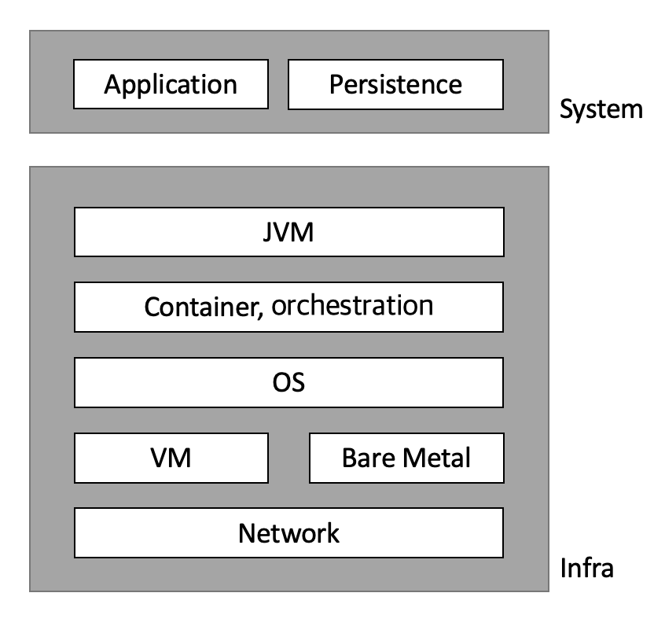

# 01. 오늘날의 보안

## I. 서론

- 애플리케이션의 기능
  - 요구사항에 따라 특정 방식으로 데이터 처리•저장•표시
- 애플리케이션의 비기능
  - 성능
  - 확장성
  - 가용성
  - 보안

> ### 비기능적 특징을 고려하지 않으면 애플리케이션 `사용자의 수익성`에 중대한 영향 발생❗️

 

## II. Spring Security: 개념과 장점

**_Spring Security_**

- Spring 애플리케이션에서 `애플리케이션 수준 보안`을 구현하기 위한 사실상의 표준 프레임워크
- 구성 요소 작성
  - 구성을 기반으로 `요청`을 가로채고, `권한`을 가진 사용자만 보호된 `리소스`에 접근 가능하도록
  - 구성 요소는 시스템의 다른 부분 간의 데이터 `전송` 및 `저장` 시 호출을 가로채 인코딩 등의 작업 수행
  - 모든 구성 요소를 Spring 방식(annotation, bean, SpEL)으로 작성 가능

> ### 어떤 부분을 구성해야 하는지 알고 시스템에서 이를 설정하는 것은 개발자의 몫❗️

 

## III. 소프트웨어 보안이란?

> ### 애플리케이션 수준 보안

: 애플리케이션의 `실행 환경`과 애플리케이션이 처리하고 저장하는 `데이터`를 보호하기 위해 해야 하는 모든 것

    

- 용어 정리
  - `컨테이너`: 논리적인 공간을 만들어 다양한 애플리케이션을 설치해 하나의 서버처럼 사용할 수 있는 패키지
  - `오케스트레이션`: 여러 개의 컴퓨터 시스템, 애플리케이션 또는 서비스의 자동화된 설정, 관리, 조정
  - `베어 메탈`: 가상화 되지 않은 물리 서버를 클라우드처럼 웹 콘솔에 간편하게 신청하여 이용할 수 있는 인프라 서비스

> ### 인증과 권한부여

- 사용자를 대신해 시스템의 특정 구성요소에 데이터의 하위집합 또는 작업에 대한 권한 부여
- 필요 이상의 권한이 부여되거나 자격 증명이 노출되지 않도록 고려
- 어키텍처에 따라 전체 시스템 수준에 이용 가능
  - 구성요소의 다른 계층에도 권한 부여를 적용 → `전역 메서드 보안`
- 애플리케이션의 책임을 가중하는 저장 데이터(Data at Rest) 암호화 저장
- 내부 메모리 관리
  - 힙 덤프 이용권리가 있는 누군가가 악용할 수 있음

 

## IV. 보안이 중요한 이유

- 애플리케이션은 모든 것을 원하는 접근 수준까지 보호해야 함
- 다른 시스템에 영향을 줄 수 있는 모든 누출을 `취약성`으로 간주하고 해결해야함

 

## V. 웹 애플리케이션의 일반적인 보안 취약성

> ### OWASP Top10

: 웹 애플리케이션 취약점 중 빈도가 높고, 보안상 영향을 크게 줄 수 있는 것들 10가지를 선정한 문서

- Injection(인젝션)
- Broken Authentication and Session Management(인증 및 세션 관리 취약점)
- Cross-Site Scripting (`XSS`) (크로스 사이트 스크립팅)
- Broken Access Control (취약한 접근 제어)
- Security Misconfiguration (보안 설정 오류)
- Sensitive Data Exposure (민감 데이터 노출)
- Insufficient Attack Protection (공격 방어 취약점)
- Cross-Site Request Forgery (`CSRF`) (크로스 사이트 요청 변조)
- Using Components with Known Vulnerabilities (알려진 취약점이 있는 컴포넌트 사용)
- Underprotected APIs (취약한 API)

> ### 인증과 권한 부여의 취약성

**_인증 (Authentication)_**  
: 애플리케이션이 이를 이용하려는 사람을 `식별`하는 프로세스  
**_권한 부여 (Authorization)_**  
: 인증된 호출자가 특정 기능과 데이터에 대한 이용 권리가 있는지 확인하는 프로세스

 

**_엔드포인트에만 보안을 적용한다면?_**  
→ 데이터 수준에 제한이 없다면 다른 사용자의 데이터를 이용할 수 있는 취약성 발생!

- `bill`이라는 이름으로 로그인
- 보호된 리소스에 접근
  - \*\*/products/bill
    - 제품 데이터 중 본인 데이터에 접근
  - \*\*/products/john
    - 제품 데이터 중 John의 데이터에 접근 → 접근을 막아야 함
- 만약 데이터 수준에 제한이 없다면?
  - 다른 타 사용자의 데이터에 접근 및 악용할 수 있음

 

## VI. 다양한 아키텍처에 적용된 보안

> ### 일체형 웹 애플리케이션 설계

- 발생 가능 보안 문제
  - 세션 고정 취약성
  - CSRF
  - HTTP 세션에 저장하는 정보
- 취약성 완화 방법
  - CSRF 방지 토큰
    - Spring Security에 기본적으로 들어있음
    - CSRF 보호와 CORS 검증이 기본적으로 활성화

> ### BE/FE 분리를 위한 보안 설계

- Session → 서버 쪽 세션을 줄이고 클라이언트 쪽 세션으로 대체하자!
- CSRF 및 CORS 구성은 일반적으로 더 복잡하다!
- 엔드포인트 인증에 HTTP Basic 사용을 지양하자!
  - HTTP Basic은
    - 호출마다 자격 증명을 전송해야 함
    - 자격 증명이 암호화 되지 않음
    - 각 엔드포인트 호출의 헤더에 자격 증명이 노출
  - 대신 OAuth 2를 사용하자!

> ### OAuth 2 흐름 이해

- 리소스 소유자 (Resource Owner)
  - 보호된 자원에 접근할 수 있는 자격을 부여해 주는 주체
  - OAuth2 프로토콜 흐름에서 클라이언트를 인증(Authorize)하는 역할을 수행
  - 인증이 완료되면 권한 획득 자격(Authorization Grant)을 클라이언트에게 부여
  - 개념적으로는 리소스 소유자가 자격을 부여하는 것이지만 일반적으로 권한 서버가 리소스 소유자와 클라이언트 사이에서 중개 역할을 수행하게 됨
- 클라이언트 (Client)
  - 보호된 자원을 사용하려고 접근 요청을 하는 애플리케이션입니다.
- 리소스 서버(Resource Server)
  - 사용자의 보호된 자원을 호스팅하는 서버
- 권한 서버 (Authorization Server)
  - 인증/인가를 수행하는 서버
  - 클라이언트의 접근 자격을 확인하고 Access Token을 발급하여 권한을 부여하는 역할을 수행

→ [OAuth 2.0 정리](https://github.com/lcomment/development-recipes/blob/main/Web/OAuth2.0.md)

> ### API 키, 암호화 서명, IP 검증을 이용해 요청 보안

→ 두 백엔드 구성 요소 간에 요청이 있을 때 해당 접근법 필요

- 요청 및 응답 헤더에 정적 키 이용
- 암호화 서명으로 요청 및 응답 서명
- IP 주소에 검증 적용
