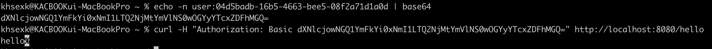
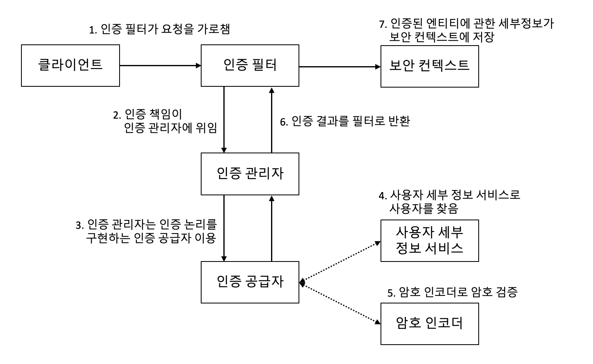

# 02. 안녕! 스프링 시큐리티

## I. 서론

> ### 설정보단 `관습` (convention-over-configuration)

- 서비스 지향 SW 아키텍처의 발전 → 각 서비스를 구성하는 상용구 코드 작성의 반복
  - `스프링 부트`가 인기를 끌게 됨
- 이번 챕터에서 이용할 접근법
  - 기본 구성에서 어떻게 작동하는지 확인
    - 이를 통해 인증•인가의 기분 구성에서 무성를 기대해야 할지 이해
  - 기본 구성 재정의 및 맞춤형 사용자와 암호 정의
  - 모든 앤드포인트 인즈 확인 및 맞춤 구성
  - 동일한 구성에 대해 다른 스타일을 적용하며 모범 사례 이해

## II. 첫 번쨰 프로젝트 시작

→ 다음과 같은 종속성만 추가

```gradle
. . .
dependencies {
    implementation 'org.springframework.boot:spring-boot-starter-security'
    implementation 'org.springframework.boot:spring-boot-starter-web'
    testImplementation 'org.springframework.boot:spring-boot-starter-test'
    testImplementation 'org.springframework.security:spring-security-test'
}
. . .
```

&nbsp; Application을 실행할 때마다 다음과 같이 새 암호가 생성된다. HTTP Basic 인증으로 엔드포인트를 호출하려면 이 암호를 이용해야 한다.

```console
Using generated security password: 09d5badb-16b5-2993-ebe5-80e2a73d1a0d
```

&nbsp; 만약 Authorization 헤더를 비워두고 엔드포인트를 호출하면,

```json
{
  "status": 401,
  "error": "Unauthorized",
  "message": "Unauthorized",
  "path": "/hello"
}
```

&nbsp; 권한 없음 에러인 `401` 에러가 반환된다. 기본적으로 Spring Security는 기본 사용자 이름과 제공된 암호를 사용한다. `curl -u user:09d5badb-16b5-2993-ebe5-80e2a73d1a0d http://localhost:8080/hello`의 명령어로 호출할 경우엔 정상적으로 동작하는 것을 확인할 수 있다.

<br>

> ### 401과 403의 차이

- 401 : 인증 실패
  - 자격 증명 누락 및 오류
- 403 : 인가 실패
  - 호출자에게 이용 권리가 없음

<br>

> ### HTTP Basic 인증을 이용한 엔드포인트 호출

- &lt;username&gt;:&lt;password&gt; 문자열을 Base64로 인코딩
- 명령을 실행하면 Base64 인코딩 반환
- 인코딩 문자열을 Authorization 헤더 값으로 사용

<p align=center>
  
</p>

<br>

## III. 기본 구성이란?

> ### 사전 구성된 요소를 애플리케이션의 필요에 맞게 작성해야 한다!

<p align=center>
  
</p>

- `인증 필터`
  - 인증 요청을 인증 관리자에 위임
  - 응답을 바탕으로 보안 컨텍스트 구성
- `인증 관리자`
  - 인증 공급자를 이용해 인증 처리
- `인증 공급자`
  - 인증 논리 구현
  - `사용자 세부 정보 서비스`를 인증 논리에 이용
    - 사용자 관리 책임을 구현
  - `암호 인코더`를 인증 논리에 이용
    - 암호 관리
- `보안 컨텍스트`
  - 인증 프로세스 후 인증 데이터 유지

<br>

> ### Spring Security에서 자동으로 구성하는 Bean

→ 인증 공급자는 이런 Bean을 이용해 사용자를 찾고 암호 확인

- **_UserDetailsService_**
  - 사용자에 관한 세부 정보는 UserDatailsService 계약을 `구현하는 객체`가 관리
  - `기본 구성` 시, 애플리케이션의 내부 메모리에 기본 자격 증명을 등록하는 일만 수행
  - 이 기본 자격 증명은 이름은 `user`, 암호는 `UUID 형식`
  - 운영 단계 애플리케이션에서는 당연히 이런 접근법을 사용하면 안됨
- **_PasswordEncoder_**
  - 암호를 `인코딩`하고, 기존 인코딩과 `일치`하는지 확인
  - Basic 인증 흐름에 꼭 필요
  - 기본 UserDetailsService와 함께 존재
    - UserDetailsService의 기본 구현을 대체할 때는 PasswordEncoder도 지정해야 함

> ### HTTP와 HTTPS

- 실제 애플리케이션에서는 HTTPS를 통해서만 통신해야 함
- HTTPS 구성 패턴
  - 애플리케이션 수준 구성
  - 서비스 메시 이용
    - 애플리케이션 트래픽을 관리, 추적 및 보안성을 강화하기 위해 플랫폼 레이어에 구성되는 네트워크 제어 방법
  - 인프라 수준 설정
- 구성을 위해선 `인증기관`(CA; Certification Authority)이 서명한 인증서 필요

**_애플리케이션 테스트 용도로 HTTPS 구성하기_**  
→ OpenSSL 같은 툴을 사용하여 자체 서명 인증서 생성

1. `openssl` 명령을 실행  
   → 개인 키를 담은 `key.pem`과 공개 인증서를 담은 `cert.pem` 생성  
   → 명령에서 암호는 꼭 기억해둬야 함

```shell
openssl req -newkey rsa:2048 -x509 - keyout key.pem -out cert.pem -days 365
```

2. 첫 번째 명령이 생성한 두 파일을 입력으로 받고 그 결과로 자체 서명 인증서 생성

```shell
openssl pkcs12 -export -in cert.pem -inkey key.pem -out certificate.p12 -name "certificate"
```

3. certificate.p12 파일을 Spring Boot 프로젝트의 resources 파일에 복사 및 설정

```yml
server:
  ssl:
    key-store-type: PKCS12
    key-store: classpath:certificate.p12
    key-store-password: 12345
```

4. 자체 서명 인증서를 이용할 때는 엔드포인트 호출하는 툴에서 인증서 신뢰성 테스트를 생략하도록 구성해야 함

```shell
curl -k https://localhost:8080/hello
```

<br>

## IV. 기본 구성 재정의
