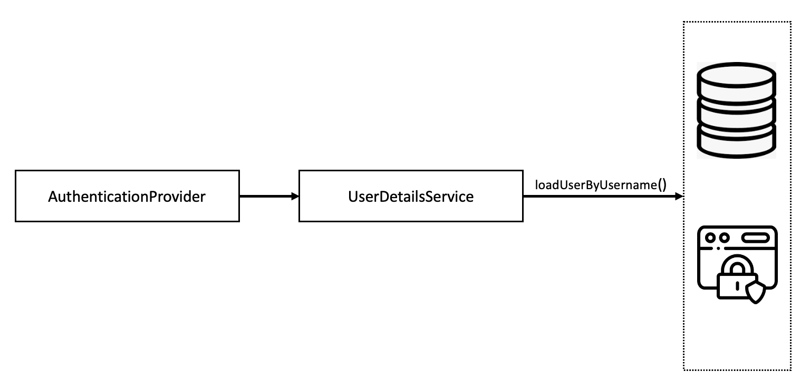
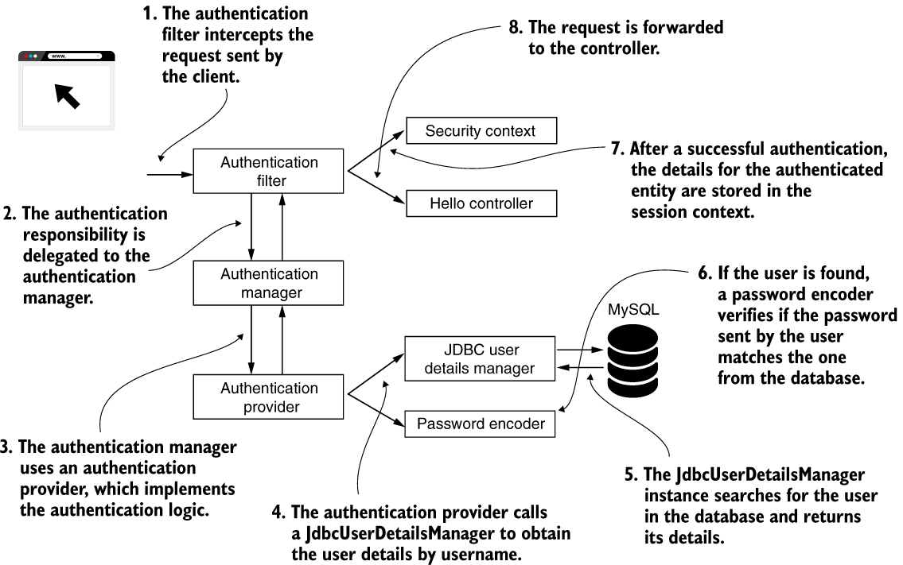

# 03. 사용자 관리

## 0. 개요

> ### UserDetailsService와 함께 다룰 내용

- Spring Security에서 `사용자 기술` → UserDetails
- 사용자가 실행할 수 있는 `작업 정의` → GrantedAuthority
- UserDetailsService `계약 확장` → UserDetailsManager

## I. 스프링 시큐리티의 인증 구현

- 사용자 관리 → `UserDetailsService` 및 `UserDetailsManager` 인터페이스 이용
- UserDetailsManager → 사용자 추가, 수정, 삭제 작업
- UserDetailsService는 사용자 이름으로 `사용자 검색`

**→ ISP 원칙의 훌륭한 예**

<br>

<p align=center>
    
</p>

- 사용자는 `이용 권리`의 집합을 가짐
- GrantedAuthority 인터페이스 → 사용자가 수행할 수 있는 작업 (권한)
- UserDetailsManager → UserDetailsService 계약 확장
- UserDetailsService → UserDetails 계약 이용
- UserDetails → 하나 이상의 권한을 가짐

<br>

## II. 사용자 기술하기

- 애플리케이션 → 사용자가 누구인지에 따라 `특정 기능`을 호출할 수 있는지 여부 결정
- 사용자에 대한 작업을 하려면 애플리케이션에서 사용자의 `프로토타입을 정의`하는 법을 알아야 함

> ### i) UserDetails 계약의 정의 이해하기

```java
public interface UserDetails extends Serializable {
    // 사용자 자격 증명 반환
    String getUsername();
    String getPassword();

    // 앱 사용자가 수행할 수 있는 작업을 GrantedAuthority 인스턴스 컬렉션으로 반환
    Collection<? extends GrantedAuthority> getAuthorities();

    // 사용자 계정을 필요에 따라 활성화 또는 비활성화 하는 네 메서드
    boolean isAccountNonExpired();
    boolean isAccountNonLocked();
    boolean isCredentialsNonExpired();
    boolean isEnabled();
}
```

- 계정 만료 → boolean isAccountNonExpired()
- 계정 잠금 → boolean isAccountNonLocked()
- 자격 증명 만료 → boolean isCredentialsNonExpired()
- 계정 비활성화 → boolean isEnabled()

<br>

> ### ii) GrantedAuthority 계약 살펴보기

```java
public interface GrantedAuthority extends Serializable {
    String getAuthority();
}
```

- `람다식` 구현
  - `@FunctionalInterface` 어노테이션을 통해 인터페이스가 함수형임을 지정하자
  - GrantedAuthority g1 = () -> "READ";
- `SimpleGrantedAuthority` 클래스
  - GrantedAuthority g2 = new SimpleGrantedAuthority("READ");

<br>

> ### iii) 최소한의 UserDetails 구현 작성

```java
@RequiredArgsConstructor
public class SimpleUser implements UserDetails {
    private final String username;
    private final String password;

    @Override
    public String getUsername() {
        return "komment";
    }

    @Override
    public String getPassword() {
        return "12345";
    }

    @Override
    public Collection<? extends GrantedAuthority> getAuthorities() {
        return List.of(() -> "READ");
    }

    @Override
    public boolean isAccountNonExpired() {
        return true;
    }

    @Override
    public boolean isAccountNonLocked() {
        return true;
    }

    @Override
    public boolean isCredentialsNonExpired() {
        return true;
    }

    @Override
    public boolean isEnabled() {
        return true;
    }
}
```

> ### iv) 빌더를 이용해 UserDetails 형식의 인스턴스 만들기

```java
// User 빌더 클래스로 사용자 구성
UserDetails u = User.withUsername("komment")
                    .password("12345")
                    .authorities("read", "write")
                    .accountExpired(false)
                    .disabled(true)
                    .build();

// 사용자 이름을 문자열로 지정
User.UserBuilder builder1 = User.withUsername("komment");

UserDetails u1 = builder1
                .password("12345")
                .authorities("read, write")
                .passwordEncoder(p -> encode(p))
                .accountExpired(true)
                .disable(true)
                .build();

// 기존 UserDetail 인스턴스에서 사용자 생성
User.UserBuilder builder2 = User.withUserDetails(u);

UserDetails u2 = builder2.build();
```

- User.withUsername() → User 클래스에 중첩된 빌더 클래스 UserBuilder의 인스턴스 반환
- Bean으로 등록되는 PasswordEncoder와 예제는 다른 것
  - 예제는 암호를 지정한 인코딩으로 변환하는 일만 함

<br>

> ### v) 사용자와 연관된 여러 책임 결합

→ 책임을 분리하여 작성하자!

```java
@Entity
@Getter
@Setter
public class User {
    @Id
    private int id;

    private String username;
    private String password;
    private String authority;
}
```

: JPA 엔티티 책임을 갖는 User 클래스

```java
@RequiredArgsConstructor
public class SecurityUser implements UserDetails {
    private final User user;

    @Override
    public String getUsername() {
        return user.getUsername();
    }

    @Override
    public String getPassword() {
        return user.getPassword();
    }

    @Override
    public Collection<? extends GrantedAuthority> getAuthorities() {
        return List.of(user::getAuthority);
    }
    . . .
}
```

: User 엔티티를 래핑하고, UserDetails 계약에 매핑하는 책임을 가진 SecurityUser 클래스

<br>

## III. 스프링 시큐리티가 사용자를 관리하는 방법 지정

- 자격증명을 비교할 때 어디에서 가져오는지?
- 새 사용자를 추가하거나 기존 사용자를 변경할 때 어떻게 하는지?

<br>

> ### i) UserDetailsService 계약의 이해

```java
public interface UserDetailsService {

    UserDetails loadUserByUsername(String username) throws UsernameNotFoundException;
}
```

- `loadUserByUsername()` → 주어진 사용자 이름을 가진 사용자의 세부 정보를 얻음
- Username은 고유하다고 가정
- 존재하지 않는 Username일 때 `throw UsernameNotFoundException`

<p align=center>
    
</p>

<br>

> ### ii) UserDetailsService 계약 구현

```java
package com.ch3.ssia;

import lombok.RequiredArgsConstructor;
import org.springframework.security.core.GrantedAuthority;
import org.springframework.security.core.userdetails.UserDetails;

import java.util.Collection;
import java.util.List;

@RequiredArgsConstructor
public class User implements UserDetails {
    private final String username;
    private final String password;
    private final String authority;

    @Override
    public Collection<? extends GrantedAuthority> getAuthorities() {
        return List.of(() -> authority);
    }

    @Override
    public String getPassword() {
        return password;
    }

    @Override
    public String getUsername() {
        return username;
    }

    @Override
    public boolean isAccountNonExpired() {
        return true;
    }

    @Override
    public boolean isAccountNonLocked() {
        return true;
    }

    @Override
    public boolean isCredentialsNonExpired() {
        return true;
    }

    @Override
    public boolean isEnabled() {
        return true;
    }
}
```

→ UserDetails 정의

```java
@RequiredArgsConstructor
public class InMemoryUserDetailsService implements UserDetailsService {
    private final List<UserDetails> users;

    @Override
    public UserDetails loadUserByUsername(String username) throws UsernameNotFoundException {
        return users.stream()
                .filter(u -> u.getUsername().equals(username))
                .findFirst()
                .orElseThrow(() -> new UsernameNotFoundException("User Not Found"));
    }
}
```

→ loadUserByUsername() 메서드 재구성

```java
@Configuration
public class SecurityConfig {
    @Bean
    public UserDetailsService userDetailsService() {
        return new InMemoryUserDetailsService(List.of(
                new User("komment",
                        "12345",
                        "read")));
    }

    @Bean
    public PasswordEncoder passwordEncoder() {
        return NoOpPasswordEncoder.getInstance();
    }
}
```

→ 구성 클래스 빈 추가 및 사용자 한명 등록

<br>

> ### iii) UserDetailsManager 계약 구현

```java
public interface UserDetailsManager extends UserDetailsService {
    void createUser(UserDetails user);
    void updateUser(UserDetails user);
    void deleteUser(String username);

    void changePassword(String oldPassword, String newPassword);
    boolean userExists(String username);
}
```

- 사용자 관리 기능 → 사용자 추가, 삭제 등등
- UserDetailsService 계약 확장 및 메서드 추가

<br>

**_JdbcUserDetailsManager_**

- SQL DB에 저장된 사용자를 관리
- JDBC를 통해 DB에 직접 연결

<p align=center>
    
</p>

1. client의 전송요청을 인증 필터가 가로챔
2. 인증 책임이 인증 관리자에 위임
3. 인증 관리자가 인증 공급자 이용
4. 안중 공급자가 JdbcUserDetailsManager 호출 → 사용자 세부정보 확인
5. JdbcUserDetailsManager가 DB에서 사용자를 찾고 세부정보 리턴
6. 사용자 발견 → 암호 인코더가 암호 확인
7. 인증 성공 → 인증된 엔티티에 대한 세부정보가 세션 텍스트에 저장
8. 요청이 컨트롤러에 전달

<br>

```java
@Configuration
public class SecurityConfig {
    @Bean
    public UserDetailsService userDetailsService(DataSource dataSource) {
        return new JdbcUserDetailsManager(dataSource);
    }

    @Bean
    public PasswordEncoder passwordEncoder() {
        return NoOpPasswordEncoder.getInstance();
    }
}
```

→ 다음과 같이 데이터 원본을 자동 연결할 수 있음

```java
@Configuration
public class SecurityConfig {
    @Bean
    public UserDetailsService userDetailsService(DataSource dataSource) {
        String userByUsernameQuery = "select username, password, enabled from users where username = ?";
        String authsByUserQuery = "select username, authority from spirng.authorities where username = ?";

        UserDetailsManager userDetailsManager = new JdbcUserDetailsManager(dataSource);
        userDetailsManager.setUserByUsernameQuery(userByUsernameQuery);
        userDetailsManager.setAuthoritiesByUsernameQuery(authsByUserQuery);

        return userDetailsManager;
    }

    . . .
}
```

→ 다음과 같이 이용 쿼리도 구성 가능
