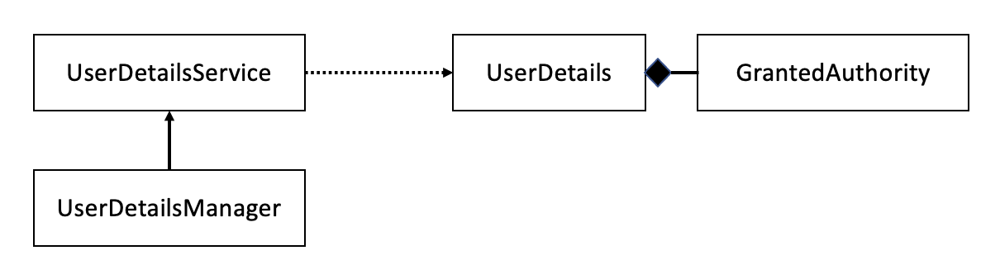

# 03. 사용자 관리

## 0. 개요

> ### UserDetailsService와 함께 다룰 내용

- Spring Security에서 `사용자 기술` → UserDetails
- 사용자가 실행할 수 있는 `작업 정의` → GrantedAuthority
- UserDetailsService `계약 확장` → UserDetailsManager

## I. 스프링 시큐리티의 인증 구현

- 사용자 관리 → `UserDetailsService` 및 `UserDetailsManager` 인터페이스 이용
- UserDetailsManager → 사용자 추가, 수정, 삭제 작업
- UserDetailsService는 사용자 이름으로 `사용자 검색`

**→ ISP 원칙의 훌륭한 예**

<br>

<p align=center>
    
</p>

- 사용자는 `이용 권리`의 집합을 가짐
- GrantedAuthority 인터페이스 → 사용자가 수행할 수 있는 작업 (권한)
- UserDetailsManager → UserDetailsService 계약 확장
- UserDetailsService → UserDetails 계약 이용
- UserDetails → 하나 이상의 권한을 가짐

<br>

## II. 사용자 기술하기

- 애플리케이션 → 사용자가 누구인지에 따라 `특정 기능`을 호출할 수 있는지 여부 결정
- 사용자에 대한 작업을 하려면 애플리케이션에서 사용자의 `프로토타입을 정의`하는 법을 알아야 함

> ### i) UserDetails 계약의 정의 이해하기

```java
public interface UserDetails extends Serializable {
    // 사용자 자격 증명 반환
    String getUsername();
    String getPassword();

    // 앱 사용자가 수행할 수 있는 작업을 GrantedAuthority 인스턴스 컬렉션으로 반환
    Collection<? extends GrantedAuthority> getAuthorities();

    // 사용자 계정을 필요에 따라 활성화 또는 비활성화 하는 네 메서드
    boolean isAccountNonExpired();
    boolean isAccountNonLocked();
    boolean isCredentialsNonExpired();
    boolean isEnabled();
}
```

- 계정 만료 → boolean isAccountNonExpired()
- 계정 잠금 → boolean isAccountNonLocked()
- 자격 증명 만료 → boolean isCredentialsNonExpired()
- 계정 비활성화 → boolean isEnabled()

<br>

> ### ii) GrantedAuthority 계약 살펴보기

```java
public interface GrantedAuthority extends Serializable {
    String getAuthority();
}
```

- `람다식` 구현
  - `@FunctionalInterface` 어노테이션을 통해 인터페이스가 함수형임을 지정하자
  - GrantedAuthority g1 = () -> "READ";
- `SimpleGrantedAuthority` 클래스
  - GrantedAuthority g2 = new SimpleGrantedAuthority("READ");

<br>

> ### iii) 최소한의 UserDetails 구현 작성

```java
@RequiredArgsConstructor
public class SimpleUser implements UserDetails {
    private final String username;
    private final String password;

    @Override
    public String getUsername() {
        return "komment";
    }

    @Override
    public String getPassword() {
        return "12345";
    }

    @Override
    public Collection<? extends GrantedAuthority> getAuthorities() {
        return List.of(() -> "READ");
    }

    @Override
    public boolean isAccountNonExpired() {
        return true;
    }

    @Override
    public boolean isAccountNonLocked() {
        return true;
    }

    @Override
    public boolean isCredentialsNonExpired() {
        return true;
    }

    @Override
    public boolean isEnabled() {
        return true;
    }
}
```

> ### iv) 빌더를 이용해 UserDetails 형식의 인스턴스 만들기

```java
// User 빌더 클래스로 사용자 구성
UserDetails u = User.withUsername("komment")
                    .password("12345")
                    .authorities("read", "write")
                    .accountExpired(false)
                    .disabled(true)
                    .build();

// 사용자 이름을 문자열로 지정
User.UserBuilder builder1 = User.withUsername("komment");

UserDetails u1 = builder1
                .password("12345")
                .authorities("read, write")
                .passwordEncoder(p -> encode(p))
                .accountExpired(true)
                .disable(true)
                .build();

// 기존 UserDetail 인스턴스에서 사용자 생성
User.UserBuilder builder2 = User.withUserDetails(u);

UserDetails u2 = builder2.build();
```

- User.withUsername() → User 클래스에 중첩된 빌더 클래스 UserBuilder의 인스턴스 반환
- Bean으로 등록되는 PasswordEncoder와 예제는 다른 것
  - 예제는 암호를 지정한 인코딩으로 변환하는 일만 함

<br>

> ### v) 사용자와 연관된 여러 책임 결합

→ 책임을 분리하여 작성하자!

```java
@Entity
@Getter
@Setter
public class User {
    @Id
    private int id;

    private String username;
    private String password;
    private String authority;
}
```

: JPA 엔티티 책임을 갖는 User 클래스

```java
@RequiredArgsConstructor
public class SecurityUser implements UserDetails {
    private final User user;

    @Override
    public String getUsername() {
        return user.getUsername();
    }

    @Override
    public String getPassword() {
        return user.getPassword();
    }

    @Override
    public Collection<? extends GrantedAuthority> getAuthorities() {
        return List.of(user::getAuthority);
    }
    . . .
}
```

: User 엔티티를 래핑하고, UserDetails 계약에 매핑하는 책임을 가진 SecurityUser 클래스

<br>

## III. 스프링 시큐리티가 사용자를 관리하는 방법 지정
