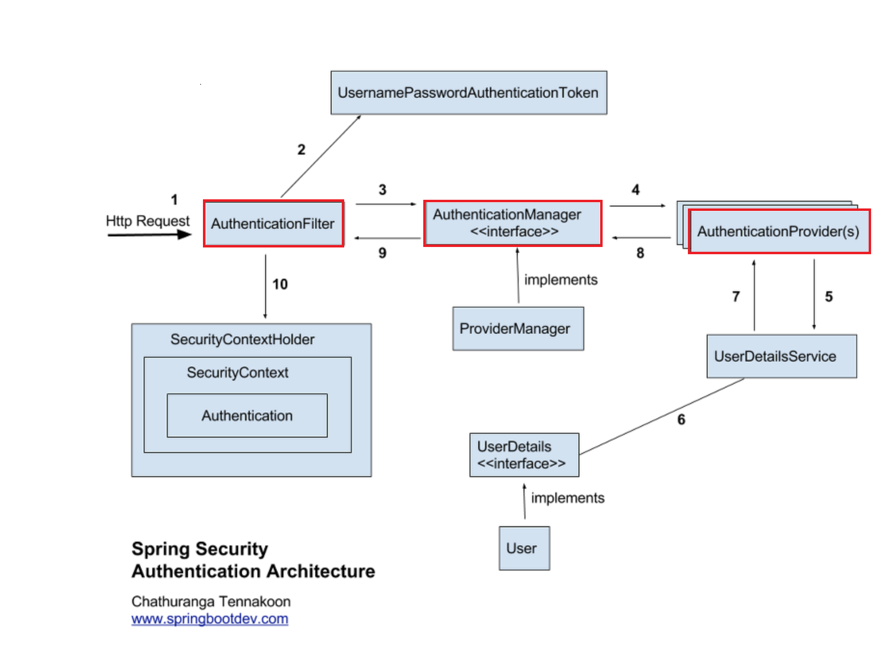
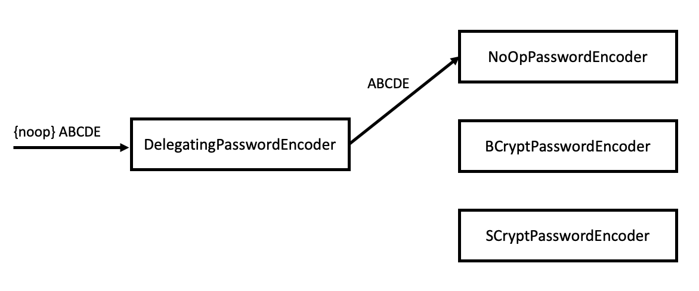

# 04. 암호 처리

<p align=center>
    
</p>

## I. PasswordEncoder 계약의 이해

**_PasswordEncoder의 역할_**

→ AuthenticationProvider가 인증 논리를 구현할 때 `사용자 암호 검증`을 위해 필요

> ### i) PasswordEncoder 계약의 정의

→ 계약을 구현해 Spring Security에 사용자 암호를 검증하는 방법을 알려줄 수 있음

- 암호 인코딩
- 계약에 선언된 `encode()` 및 `maches()` 메서드는 `계약의 책임` 정의

```java
public interface PasswordEncoder {

    String encode(CharSequence rawPassword);
    boolean matches(CharSequence rawPassword, String encodedPassword);

    default boolean upgradeEncoding(String encodedPassword) {
        return false;
    }
}
```

- encode(CharSequence rawPassword)
  - 주어진 문자열을 암호화 해 반환
- matches(CharSequence rawPassword, String encodedPassword)
  - 인코딩된 문자열이 원시 암호와 일치하는지 확인
- upgradeEncoding(String encodedPassword)
  - default: false 반환
  - true로 재정의 → 인코딩된 암호를 보안 향상을 위해 `다시 인코딩`

<br>

> ### ii) PasswordEncoder 계약의 구현

- matches()와 encode()를 재정의하려면 기능 면에서 항상 일치해야 함
- PasswordEncoder를 구현할 수 있으면 애플리케이션 인증 프로세스에서 `암호 관리법 선택 가능`

**_❶ 인코딩 없는 PasswordEncoder 구현_**

```java
public class PlainTexctPasswordEncoder implements PasswordEncoder {

    @Override
    public String encode(CharSequence rawPassword) {
        return rawPassword.toString();
    }

    @Override
    public boolean matches(CharSequence rawPassword, String encodedPassword) {
        return rawPassword.equals(encodedPassword);
    }
}
```

<br>

**_❷ SHA-512를 이용한 PasswordEncoder 구현_**

```java
public class Sha512PasswordEncoder implements PasswordEncoder {
    @Override
    public String encode(CharSequence rawPassword) {
        return hashWithSHA512(rawPassword.toString());
    }

    @Override
    public boolean matches(CharSequence rawPassword, String encodedPassword) {
        return encodedPassword.equals(encode(rawPassword));
    }

    private String hashWithSHA512(String input) {
        StringBuilder sb = new StringBuilder();

        try {
            MessageDigest md = MessageDigest.getInstance("SHA-512");
            byte[] digested = md.digest(input.getBytes());

            for (byte b : digested) { sb.append(Integer.toHexString(0xFF & b)); }
        } catch (NoSuchAlgorithmException e) {
            throw new RuntimeException(e);
        }

        return sb.toString();
    }
}
```

<br>

> ### iii) PasswordEncoder의 제공된 구현 선택

**_NoOpPasswordEncoder_**

- 암호를 인코딩 하지 않고 일반 TEXT로 유지
- getInstance() 메서드를 통한 `싱글톤`

```java
PasswordEncoder p = NoOpPasswordEncoder.getInstance();
```

<br>

**_StandardPasswordEncoder_**

- SHA-256을 이용해 암호를 해싱
- 강도가 약한 해싱 알고리즘이므로 지양해야 함
- 생성자를 통해 `secrey key` 전달 가능

```java
PasswordEncoder p = new StandardPasswordEncoder();
PasswordEncoder p = new StandardPasswordEncoder("secret-key");
```

<br>

**_Pbkdf2PasswordEncoder_**

- `PBKDF2`(NIST(미국표준기술연구소)에 의해서 승인된 알고리즘) 이용
- 반복 횟수 인자만큼 HMAC를 수행하는 아주 단순하고 느린 해싱 함수
- 특징
  - 암호 인코딩 반복 횟수 → default = 185,000
  - 해시의 크기 → default = 256
  - 해시가 길수록 암호 강력 → But. 리소스 증가로 인한 성능 이슈 발생

```java
PasswordEncoder p = new Pbkdf2PasswordEncoder();
PasswordEncoder p = new Pbkdf2PasswordEncoder("secret-key");

// 시크릿 키, 암호 잌노딩 반복횟수, 해시 크기
PasswordEncoder p = new Pbkdf2PasswordEncoder("secret-key", 185000, 256);
```

<br>

**_BCryptPasswordEncoder_**

- bcrypt 강력 해싱 함수로 암호 인코딩
- 로그 라운드를 나타내는 `강도 계수` 지정 가능
  - 반복 횟수에 영향을 줌
- 인코딩에 이용되는 `SecureRandom` 인스턴스 변경 가능

```java
PasswordEncoder p = new BCryptPasswordEncoder();
PasswordEncoder p = new BCryptPasswordEncoder(4);

PasswordEncoder p = new BCryptPasswordEncoder(4, SecureRandom.getInstanceStrong());
```

<br>

**_SCryptPasswordEncoder_**

- scrypt 해싱 함수로 암호 인코딩
- 두 가지 생성자 존재

```java
PasswordEncoder p = new SCrytPasswordEncoder();

// CPU 비용, 메모리 비용, 병렬화 계수, 키 길이, 솔트 길이
PasswordEncoder p = new SCrytPasswordEncoder(16384, 8, 1, 32, 64);
```

<br>

**_Salt Round_**

: 실제 비용 요소

- 해싱 계산하는 데 필요한 시간 제어
- 높을수록 더 많은 해싱 라운드가 이루어짐
- 비용 요소를 1 증가 시키려면 시간이 2배가 됨

<br>

> ### iv) DelegatingPasswordEncoder를 이용한 여러 인코딩 전략

- 인증 흐름에 암호 일치를 위해 다양한 구현을 적용
- 애플리케이션에서 PasswordEncoder로 작동하는 유용한 툴을 적용

<p align=center>
    
</p>

## **_DelegatingPasswordEncoder_**

- 자체 인코딩 알고리즘을 구현하는 대신 같은 계약의 `다른 구현 인스턴스`에 작업 위임
- 암호의 `접두사`를 기준으로 올바름 PasswordEncoder 구현에 작업 위임
- 중괄호는 접두사의 필수

```java
@Configuration
public class ProjectConfig {

    //  생략된 코드

    @Bean
    public PasswordEncoder passwordEncoder() {
        Map<String, PasswordEncoder> encoders = new HashMap<>();

        // 인코더
        encoders.put("noop", NoOpPasswordEncoder.getInstance());
        encoders.put("bcrypt", new BCryptPasswordEncoder());
        encoders.put("scrypt", new SCryptPasswordEncoder());

        // 기본적으로 BCryptPasswordEncoder에 위임
        return new DelegatingPasswordEncoder("bcrypt", encoders);
    }
}
```

<br>

## II. 스프링 시큐리티 암호화 모듈에 관한 추가 정보

- `인코딩`
  - 주어진 입력에 대한 모든 변환
- `암호화`
  - 출력을 얻기 위해 입력 값과 키를 모두 지정하는 특정한 유형의 인코딩
  - (x, k1) → y
    - x: 입력
    - k1: 키
    - y: 암호화 결과
  - (y, k2) → x : `역함수 복호화`
    - k1 != k2 → `비대칭 키`
    - k1: 공개 키
    - k2: 개인 키
- `해싱`
  - 함수가 한 방향으로만 작동하는 특정한 유형의 인코딩
  - 해싱함수의 출력 y에서 입력 x를 얻을 수 없음
  - But. 출력 y가 입력 x에 해당하는지 확인할 수 있어야 함
  - ex. x→y라면 `(x, y)→boolean` 일치함수가 있어야 함
- 암호화 및 복호화 함수, 키 생성 기능 → 자바에서 기본 제공되지 않음
  - Spring Security에서 종속성을 줄일 수 있는 `자체 솔루션 제공`

<br>

> ### i) 키 생성기 이용

- BytesKeyGenerator 및 StringKeyGenerator
  - 키 생성기의 두 가지 주요 유형을 나타내는 인터페이스
- KeyGenerators
  - 팩터리 클래스로 직접 만들 수도 있음

```java
public interface StringKeyGenerator {
  String generateKey();
}
```

<br>

```java
public interface BytesKeyGenerator {
  int getKeyLength();
  byte[] generateKey();
}
```

→ [실습코드](https://github.com/lcomment/spring-security-in-action/blob/master/00_실습/ssia-ch4-ex1/src/main/java/com/ch4/ssia/crypto/Test.java)

<br>

> ### ii) 암호화와 복호화 작업에 암호기 이용

- 암호기
  - 암호화 알고리즘을 구현하는 객체
  - 암호화와 복호화 기능을 제공

```java
public interface TextEncryptor {
  String encrypt(String text);
  String decrypt(String encryptedText);
}
```

<br>

```java
public interface BytesEncryptor {
  byte[] encrypt(byte[] byteArray);
  byte[] decrypt(byte[] encryptedByteArray)
}
```
